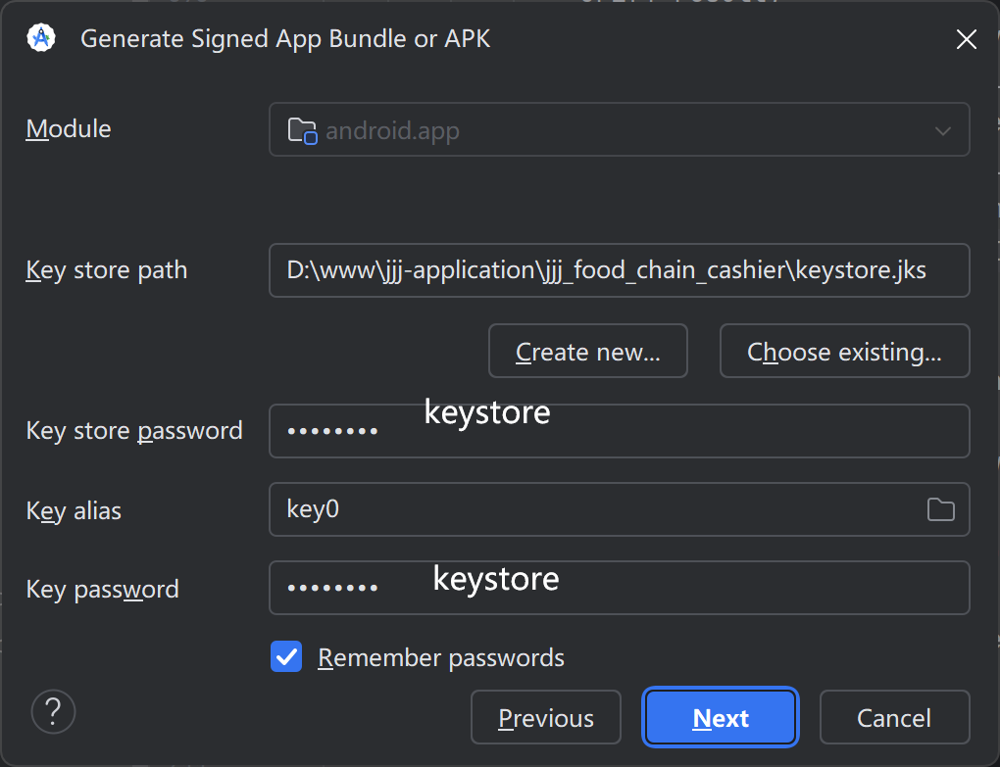

### 开发环境
- ~~`nodejs 16.20.2`~~
- 打包apk需要nodejs 20+，目前版本 `nodejs 20.19.0`

### 安装

~~~
npm install
~~~

### 运行

~~~
npm run dev
~~~

### 打包

~~~
npm run build
~~~

### 打包安卓APK

- 打包vue项目

~~~
npm run build:app
~~~

- 同步到安卓项目

~~~
npx cap sync android
~~~

- 在 Android Studio 中构建并运行模拟器。
~~~
npx cap open android
~~~

- android studio 淘宝镜像

~~~
repositories {
    maven { url 'https://maven.aliyun.com/repository/public' }
    maven { url 'https://maven.aliyun.com/repository/google' }
    maven { url 'https://maven.aliyun.com/repository/gradle-plugin' }
    google()
    mavenCentral()
}
~~~

### 备注
- 如 nodejs 依赖安装不上请使用 cnpm ，pnpm，中国镜像等方法
- Android Gradle 8.0+ (AGP 8.0) JDK 17+
- 使用工具 capacitor 打包app
- 签名密钥（jks文件）密码：keystore

